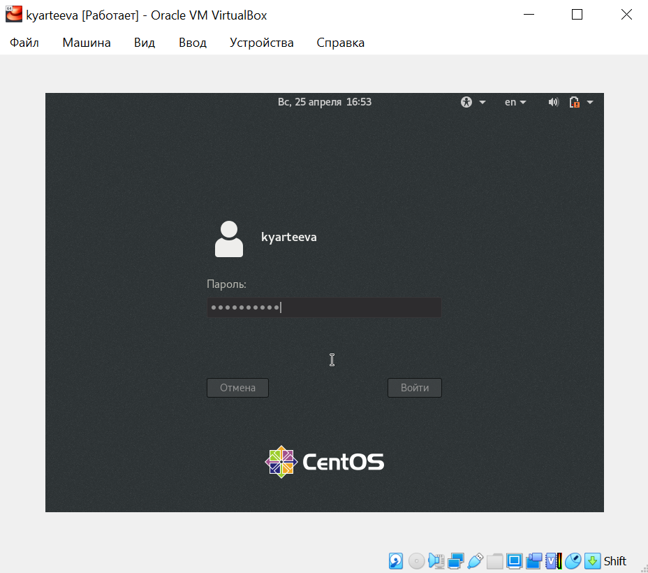

# Презентация по лабораторной работе №1
Установка и конфигурация операционной системы на виртуальную машину

***Российский Университет Дружбы Народов***

***Факультет Физико-Математических и Естественных Наук***

 ***Дисциплина:*** *Операционные системы*

 ***Работу выполняла:*** *Артеева Кристина Юрьевна*

 *1032202463*

 *НКНбд-01-20*
 ---

В ходе изучения курса "Операционные системы" передо мной встала следующая цель:приобрести практические навыки установки операционной системы на виртуальную машину, настройки минимально необходимых для
дальнейшей работы сервисов.

 ---
 Данная задача была разбита на следующие подзадачи:
- Скачать виртуальную машину.
- Создать виртуальную машину.
- Настроить виртуальную машину.

 Изучив теоретический материал, мне удалось достигнуть поставленной цели.

 ---

 В ходе работы возникали некоторые сложности, но изучив теоретические материалы, мне удалось их разрешить.
 Сейчас на моем компьютере стоит виртуальная машина с Linux версии Red Hat, образ CentOS c основной виртуальной памятью 1024Мб и диском в 40Гб.

 ---

 

 ---

 # Вывод
 Данная лабораторная работа помогла мне научиться таким важным и нужным навыкам, как установка операционной системы на виртуальную машину, настройка виртуальной машины и ОС для дальнейшей работы.
