# Отчёт о выполнении лабораторной работы
 №6 Анализ файловой системы Linux. Команды для работы с файлами и каталогами

***Российский Университет Дружбы Народов***  
***Факультет Физико-Математических и Естественных Наук***  

 ***Дисциплина:*** *Операционные системы*  
 
 ***Работу выполняла:*** *Артеева Кристина*  
 
 *1032201673*  
 
 *НКНбд-01-20*  
 
 
## Цель работы 
Ознакомление с файловой системой Linux, её структурой, именами и содержа-
нием каталогов. Приобретение практических навыков по применению команд для
работы с файлами и каталогами, по управлению процессами (и работами), по про-
верке использования диска и обслуживанию файловой системы.

## Задание 
1. Выполните все примеры, приведённые в первой части описания лабораторной
работы.
2. Выполните следующие действия, зафиксировав в отчёте по лабораторной работе
используемые при этом команды и результаты их выполнения:
- Скопируйте файл /usr/include/sys/io.h в домашний каталог и назовите
его equipment. Если файла io.h нет, то используйте любой другой файл в
каталоге /usr/include/sys/ вместо него.
- В домашнем каталоге создайте директорию ~/ski.plases.
- Переместите файл equipment в каталог ~/ski.plases.
- Переименуйте файл ~/ski.plases/equipment в ~/ski.plases/equiplist.
- Создайте в домашнем каталоге файл abc1 и скопируйте его в каталог ~/ski.plases, назовите его equiplist2.
- Создайте каталог с именем equipment в каталоге ~/ski.plases.
- Переместите файлы ~/ski.plases/equiplist и equiplist2 в каталог ~/ski.plases/equipment.
- Создайте и переместите каталог ~/newdir в каталог ~/ski.plases и назо-
вите его plans.
3. Определите опции команды chmod, необходимые для того, чтобы присвоить перечисленным ниже файлам выделенные права доступа, считая, что в начале таких прав нет:
- drwxr--r-- ... australia
- drwx--x--x ... play
- -r-xr--r-- ... my_os
- -rw-rw-r-- ... feathers
При необходимости создайте нужные файлы.
4. Проделайте приведённые ниже упражнения, записывая в отчёт по лабораторной
работе используемые при этом команды:
-  Просмотрите содержимое файла /etc/password.  
-  Скопируйте файл ~/feathers в файл ~/file.old.
- Переместите файл ~/file.old в каталог ~/play.
- Скопируйте каталог ~/play в каталог ~/fun.
- Переместите каталог ~/fun в каталог ~/play и назовите его games.
- Лишите владельца файла ~/feathers права на чтение.
- Что произойдёт, если вы попытаетесь просмотреть файл ~/feathers командой cat?
- Что произойдёт, если вы попытаетесь скопировать файл ~/feathers?
- Дайте владельцу файла ~/feathers право на чтение.
- Лишите владельца каталога ~/play права на выполнение.
- Перейдите в каталог ~/play. Что произошло?
- Дайте владельцу каталога ~/play право на выполнение.
5. Прочитайте man по командам mount, fsck, mkfs, kill и кратко их охарактери-
зуйте, приведя примеры.

## Выполнение работы
1. Выполнила следующие действия:
- Скопировала файл /usr/include/sys/io.txt в домашний каталог и назвала
его equipment.
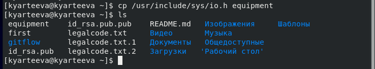

- В домашнем каталоге создала директорию ~/ski.plases.
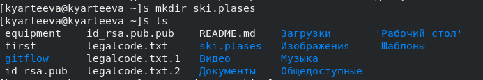

- Переместила файл equipment в каталог ~/ski.plases.
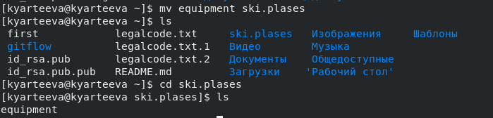

- Переименовала файл ~/ski.plases/equipment в ~/ski.plases/equiplist.
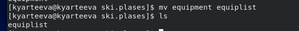

- Создала в домашнем каталоге файл abc1 и скопируйте его в каталог ~/ski.plases, назовите его equiplist2.
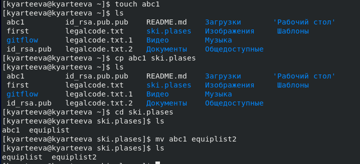

- Создала каталог с именем equipment в каталоге ~/ski.plases.
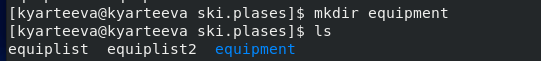

- Переместила файлы ~/ski.plases/equiplist и equiplist2 в каталог
~/ski.plases/equipment.
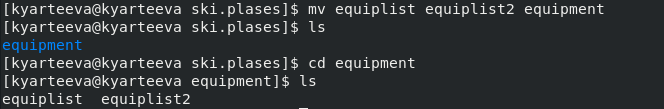

- Создала и переместите каталог ~/newdir в каталог ~/ski.plases и назовите его plans.
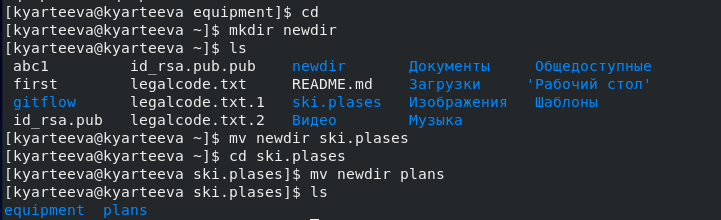

2. Определила опции команды chmod, необходимые для того, чтобы присвоить перечисленным ниже файлам выделенные права доступа, считая, что в начале таких прав нет:
- drwxr--r-- ... australia
- drwx--x--x ... play
- -r-xr--r-- ... my_os
- -rw-rw-r-- ... feathers

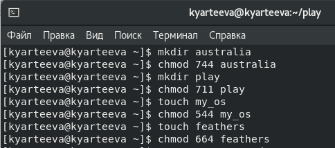
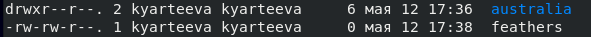
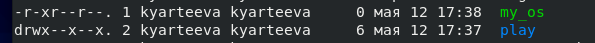

3. Проделала приведённые ниже упражнения, записывая в отчёт по лабораторной работе используемые при этом команды:
- Просмотрела содержимое файла /etc/password.
- Скопировала файл ~/feathers в файл ~/file.old.
- Переместила файл ~/file.old в каталог ~/play.
- Скопировала каталог ~/play в каталог ~/fun.
- Переместила каталог ~/fun в каталог ~/play и назвала его games.
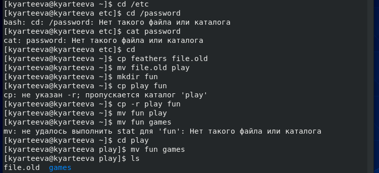

- Лишила владельца файла ~/feathers права на чтение.
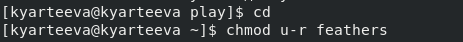


- Не получилось  просмотреть файл ~/feathers командой cat, отказано в доступе.
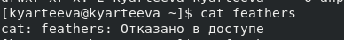

- Не получилось скопировать файл ~/feathers, отказано в доступе.
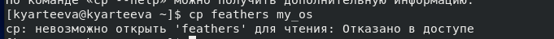

- Дала владельцу файла ~/feathers право на чтение.
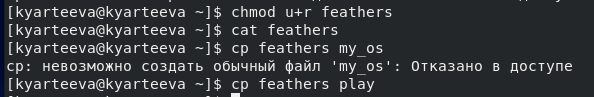

- Лишите владельца каталога ~/play права на выполнение.
- НЕ получилось перейти в каталог ~/play. 
- Дайла владельцу каталога ~/play право на выполнение.
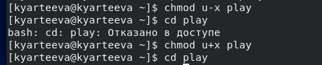
5. Прочитала man по командам mount, fsck, mkfs, kill
Это команды для работы с файловой системой:
mount используется для подключения (монтирования) файловых систем и переносных накопителей
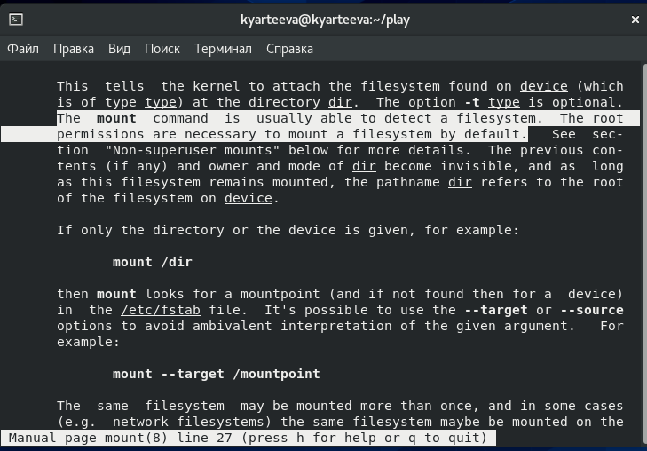

fsck - проверяет файловую систему и исправляет в одной или нескольких файловых системах Linux.
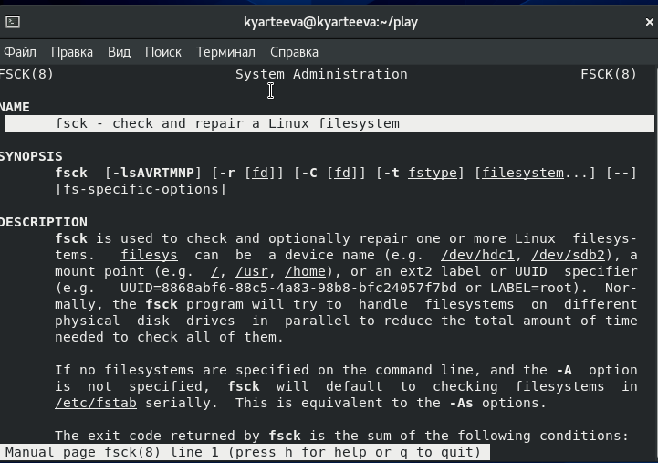

mkfs - позволяет создать файловую систему Linux
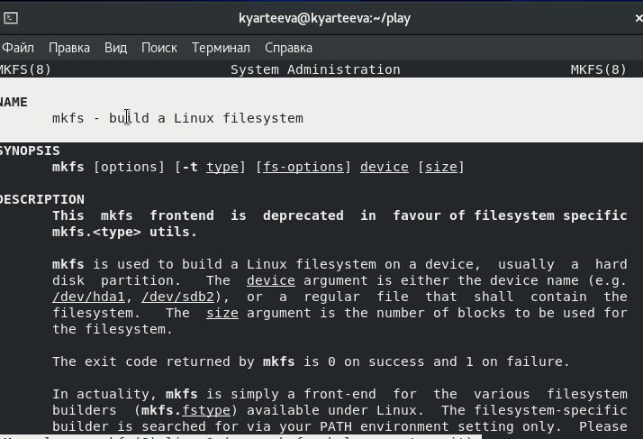

kill - прекращает процесс
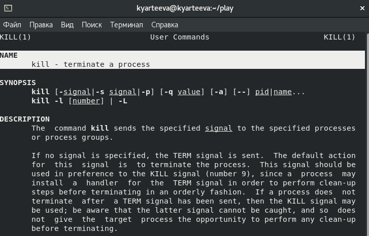

## Контрольные вопросы
1.  NTFS – основная файловая система семейства Windows NT.
    TmpFS — это быстрая и эффективная файловая система в ОЗУ, а не на ПЗУ, как прочие ФС. Предназначена для временного хранения файлов с оптимальным расходом памяти и скоростными характеристиками. Обычно используется при монтировании в каталог /tmp, в котором много постоянно меняющихся временных мелких файлов, поэтому может быть целесообразно размещать их в памяти.
    Ext4 - журналируемая файловая система, используемая в ОС на ядре Linux. Основана на файловой системе Ext3, но отличается тем, что в ней представлен механизм записи файлов в непрерывные участки блоков (екстенты), уменьшающий фрагментацию и повышающий производительность.

2. /bin - основные программы, необходимые для работы в системе: командные оболочки shell, основные утилиты

    /boot - каталог, который содержит ядро системы— главную программу, загружающую и исполняющую все остальные

    /dev - каталог, в котором содержатся псевдофайлы устройств. с точки зрения linux все физические устройства, как главные, так и периферийные, представляют собой файлы особого типа, в которые система может записывать данные и из которых она может их считывать. пользователь не должен работать с этими файлами, поскольку запись неправильных данных в файл устройства может повредить устройство или хранящиеся на нём данные

    /etc - в этом каталоге содержатся системные конфигурационные файлы — текстовые файлы, которые считываются при загрузке системы и запуске программ и определяют их поведение. настройка и администрирование linux в конечном итоге сводится к редактированию этих файлов, даже если оно выполняется при помощи графических средств конфигурирования системы

    /home - в структуре файловой системы linux каждый пользователь имеет отдельный личный каталог для своих данных (т.н. домашний каталог), и все пользовательские каталоги выделены в отдельный общий каталог /home

    /mnt - каталоги для монтирования файловых систем сменных устройств и внешних файловых систем

    /proc - файловая система на виртуальном устройстве, её файлы содержат информацию о текущем состоянии системы

    /root - каталог администратора системы

    /sbin - системные утилиты

    /usr - программы и библиотеки, доступные пользователю

    /var - рабочие файлы программ, различные временные данные: очереди (письма на отправку, файлы на печать и др.), системные журналы (файлы, в которые записывается информация о происходящих в системе событиях)

    /tmp - временные файлы

3. Для того чтобы содержимое некоторой файловой системы было доступно операционной системе, необходимо выполнить команду mount 
4. Основные причины нарушения целостности файловой системы: фппаратный сбой, программные прерывания, ошибка по вине человека. Команда fsck производит исправление файловой системы.
5. Создать файловую систему linux, семейства ext, на устройстве можно с помощью команды mkfs.
6. Для просмотра небольших файлов
удобно пользоваться командой cat.
Формат команды:
```cat имя-файла```
Для просмотра больших файлов используйте команду less — она позволяет осуществлять постраничный просмотр файлов (длина страницы соответствует размеру экрана).
Формат команды:
```less имя-файла```
7. Копирование файлов и каталогов осуществляется при помощи команды cp.
Формат команды:
cp [-опции] исходный_файл целевой_файл
CP может осуществлять Копирование файлов в текущий или произвольный каталог. 
8. Команды mv и mvdir предназначены для перемещения и переименования файлов и каталогов.
Формат команды mv:
```mv [-опции] старый_файл новый_файлё```
Позволяет делать: 
Переименование файлов в текущем каталоге;
Перемещение файлов в другой каталог;
Переименование каталогов в текущем каталоге;
Перемещение каталога в другой каталог;
Переименование каталога, не являющегося текущим;
9. Права доступа — совокупность правил, регламентирующих порядок и условия доступа субъекта к объектам информационной системы. Права доступа к файлу или каталогу можно изменить, воспользовавшись командой ```chmod```. Сделать это может владелец файла (или каталога) или пользовательс правами администратора.

## Вывод
> В ходе лабораторной работы я познакомилась с файловой системой Linux, её структурой, именами и содержанием каталогов. Приобрела практические навыки по применению команд для работы с файлами и каталогами, по управлению процессами, по проверке использования диска и обслуживанию файловой системы.

