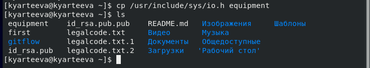
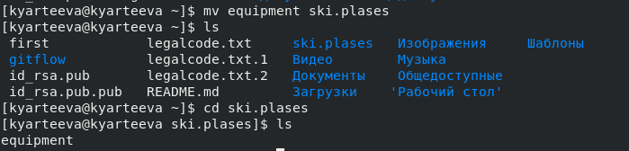
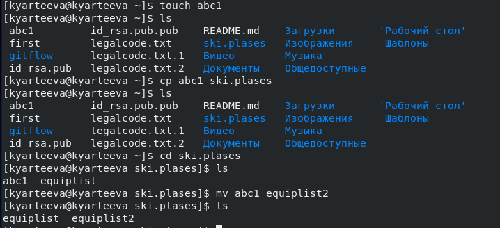
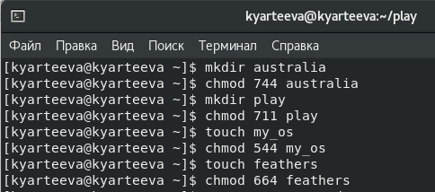

# Презентация по лабораторной работе №6
        Анализ файловой системы Linux. Команды для работы с файлами и каталогами.

***Российский Университет Дружбы Народов***

***Факультет Физико-Математических и Естественных Наук***

 ***Дисциплина:*** *Операционные системы*

 ***Работу выполняла:*** *Артеева Кристина Юрьевна*

 *1032202463*

 *НКНбд-01-20*
 ---

В ходе изучения курса "Операционные системы" передо мной встала следующая цель: ознакомиться с файловой системой Linux, её структурой, именами и содержанием каталогов. 
Приобрести практические навыки по применению команд для
работы с файлами и каталогами, по управлению процессами, по проверке использования диска и обслуживанию файловой системы.

 ---
 Данная задача была разбита на следующие подзадачи:
- Овладеть перемещением, копированием и переименованием файлов и каталогов через консоль.
- Открывать файлы в различных форматах, настраивать права доступа
- Работать с файловой системой.

 Изучив теоретический материал, мне удалось достигнуть поставленной цели.

 ---

 * В ходе работы возникали некоторые сложности, но изучив теоретические материалы, мне удалось их разрешить.
Сейчас я могу совершать основные операции через консоль, а именно 
создание, копирование и перемещение файлов, просмотр и изменение прав доступа и др.
 ---
Рис.1 Копирование файла

 

Рис.2 Перемещение файла

 

Рис.3 Создание файла

 

Рис.4 Изменение прав доступа

 

Рис.5 Просмотр прав доступа

 

 ---

 # Вывод
 В ходе лабораторной работы я познакомилась с файловой системой Linux, её структурой, приобрела практические навыки применению команд для
работы с файлами и каталогами, по управлению процессами, по проверке использования диска и обслуживанию файловой системы..
