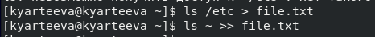

# Отчёт о выполнении лабораторной работы 
№7 Поиск файлов. Перенаправление ввода-вывода. Просмотр запущенных процессов

***Российский Университет Дружбы Народов***  
***Факультет Физико-Математических и Естественных Наук***  

 ***Дисциплина:*** *Операционные системы*  
 
 ***Работу выполняла:*** *Артеева Кристина*  
 
 *1032201673*  
 
 *НКНбд-01-20*  
 
 
 
## Цель работы 
Ознакомление с инструментами поиска файлов и фильтрации текстовых данных.
Приобретение практических навыков: по управлению процессами по проверке использования диска и обслуживанию файловых систем.

## Задание 
1. Осуществите вход в систему, используя соответствующее имя пользователя.
2. Запишите в файл file.txt названия файлов, содержащихся в каталоге /etc.
Допишите в этот же файл названия файлов, содержащихся в вашем домашнем
каталоге.
3. Выведите имена всех файлов из file.txt, имеющих расширение .conf, после
чего запишите их в новый текстовой файл conf.txt.
4. Определите, какие файлы в вашем домашнем каталоге имеют имена, начинав-
шиеся с символа c? Предложите несколько вариантов, как это сделать.
5. Выведите на экран (по странично) имена файлов из каталога /etc, начинающи-
еся с символа h.
6. Запустите в фоновом режиме процесс, который будет записывать в файл
~/logfile файлы, имена которых начинаются с log.
7. Удалите файл ~/logfile.
8. Запустите из консоли в фоновом режиме редактор gedit.
9. Определите идентификатор процесса gedit, используя команду ps, конвейер и
фильтр grep. Можно ли определить этот идентификатор более простым спосо-
бом?
10. Прочтите справку (man) команды kill, после чего используйте её для заверше-
ния процесса gedit.
11. Выполните команды df и du, предварительно получив более подробную инфор-
мацию об этих командах, с помощью команды man.
12. Воспользовавшись справкой команды find, выведите имена всех директорий,
имеющихся в вашем домашнем каталоге.

## Выполнение работы
1. Записала в файл file.txt названия файлов, содержащихся в каталоге /etс и названия файлов, содержащихся в домашнем каталоге.

2. Вывела имена всех файлов из file.txt, имеющих расширение .conf, и записала их в новый текстовой файл conf.txt.
  

3. Определила, какие файлы в вашем домашнем каталоге имеют имена, начинавшиеся с символа с.
 1 способ: find; 2 способ: ls в файл и grep.
  

4. Вывела на экран (постранично) имена файлов из каталога /etc, начинающиеся с символа h. 
  
  
  
