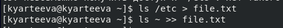
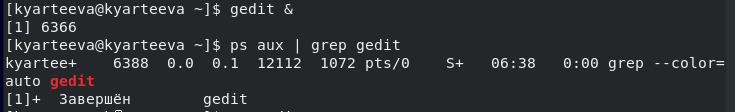
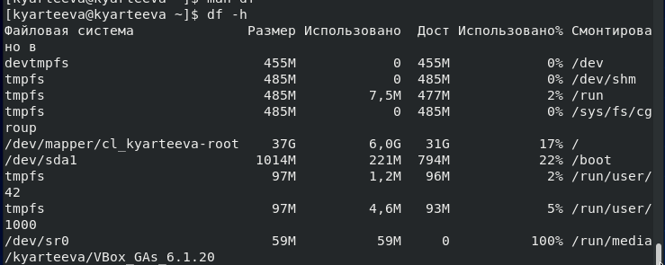

# Презентация по лабораторной работе №7
     Поиск файлов. Перенаправление ввода-вывода. Просмотр запущенных процессов

***Российский Университет Дружбы Народов***

***Факультет Физико-Математических и Естественных Наук***

 ***Дисциплина:*** *Операционные системы*

 ***Работу выполняла:*** *Артеева Кристина Юрьевна*

 *1032202463*

 *НКНбд-01-20*
 ---

В ходе изучения курса "Операционные системы" передо мной встала следующая цель: познакомиться с инструментами поиска файлов и фильтрации текстовых данных.
Приобрести практические навыки по управлению процессами, по проверке использования диска и обслуживанию файловых систем.

 ---
 Данная задача была разбита на следующие подзадачи:
- научиться перенаправлять ввод-вывод данных
- научиться искать файлы по заданным критериям и поиск информации в файлах
- научиться просматривать и прекращать запущенные процессы

 Изучив теоретический материал, мне удалось достигнуть поставленной цели.

 ---

 * В ходе работы возникали некоторые сложности, но изучив теоретические материалы, мне удалось их разрешить.
Сейчас я могу совершать основные операции по управлению процессами, по поиска файлов и фильтрации текствовых данных, а также могу осуществлять проверку использования диска и обслуживание файловых систем.
 ---

Рис.1 Запись в файл

 

Рис.2 Запуск процесса в фоновом режиме

  

Рис.3 Прекращение процесса

Рис.4 Определене объема свободной памяти на жёстком диске

 

 ---

 # Вывод
 В ходе лабораторной работы я познакомилась с файловой системой Linux, её структурой, приобрела практические навыки применению команд для
работы с файлами и каталогами, по управлению процессами, по проверке использования диска и обслуживанию файловой системы.
