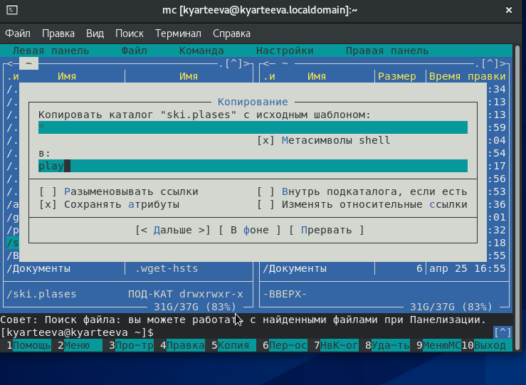
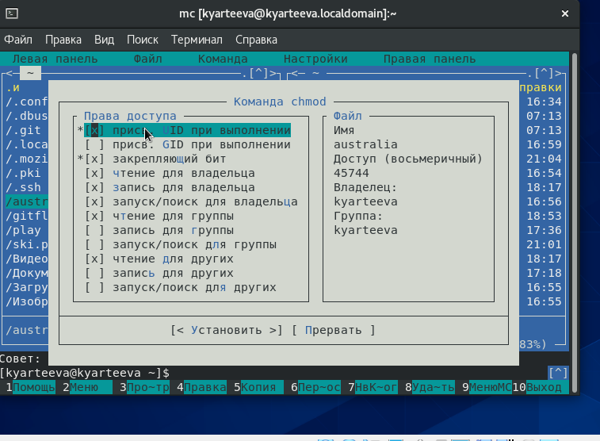
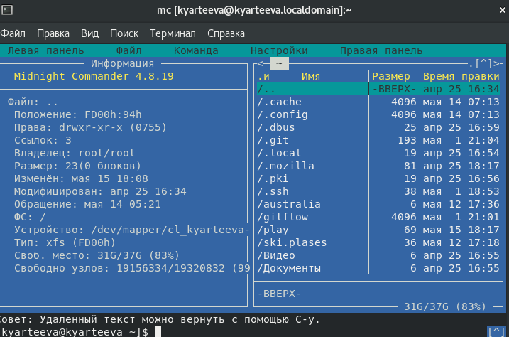
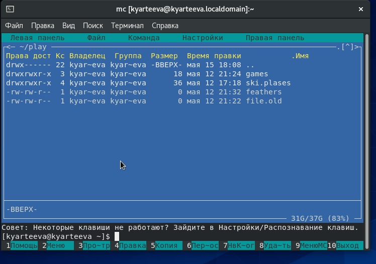
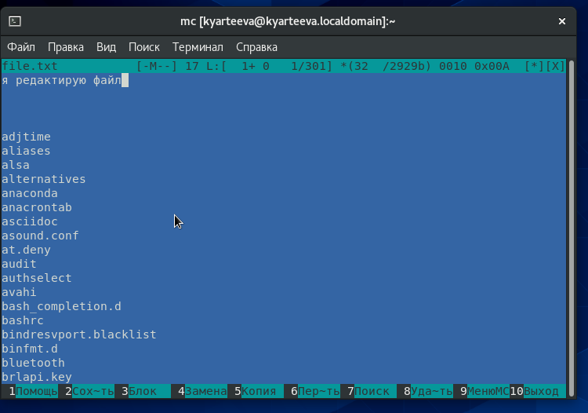
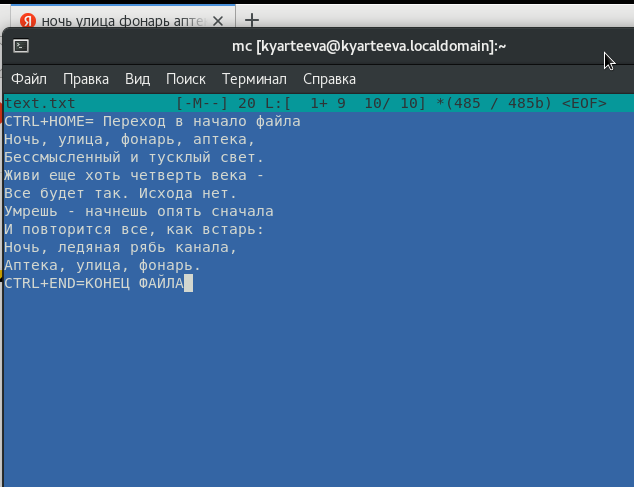

# Презентация по лабораторной работе №8
        Командная оболочка Midnight Commander

***Российский Университет Дружбы Народов***

***Факультет Физико-Математических и Естественных Наук***

 ***Дисциплина:*** *Операционные системы*

 ***Работу выполняла:*** *Артеева Кристина Юрьевна*

 *1032202463*

 *НКНбд-01-20*
 ---

В ходе изучения курса "Операционные системы" передо мной встала следующая цель: освоить основные возможностей командной оболочки Midnight Commander. Приобрести навыки практической работы по просмотру каталогов и файлов; манипуляций с ними.

 ---
 Данная задача была разбита на следующие подзадачи:
- научиться работать с файлами через интерфейс Midnight Commander
- научиться работать с файлами через текстовый редактор Midnight Commander

 Изучив теоретический материал, мне удалось достигнуть поставленной цели.

 ---

 * В ходе работы возникали некоторые сложности, но изучив теоретические материалы, мне удалось их разрешить.
Сейчас я ориентируюсь в интерфейсе Midnight Commander, могу совершать основные операции, а именно 
операции с панелями; выделение/отмена выделения файлов, копирование/перемещение файлов, получение информации о размере и правах доступа
на файлы и/или каталоги и т.п. Также поработала со встроенным редактором mc
 ---
Рис.1 Копирование файла

Рис.2 Просмотр прав доступа

Рис.3 Информация о файле

Рис.4 Информация о правах доступа

Рис.5 Редактирование  

Рис.6 Редактирование

 ---

 # Вывод
 В ходе лабораторной работы я освоила основные возможности командной оболочки Midnight Commander, приобрела навыки практической работы по просмотру каталогов и файлов; манипуляций с ними.
