# Отчёт о выполнении лабораторной работы №9 
       Текстовый редактор vi


***Российский Университет Дружбы Народов***  
***Факультет Физико-Математических и Естественных Наук***  

 ***Дисциплина:*** *Операционные системы*  
 
 ***Работу выполняла:*** *Артеева Кристина*  
 
 *1032201673*  
 
 *НКНбд-01-20*  
 
 
## Цель работы 
    Познакомиться с операционной системой Linux. Получить практические навыки работы с редактором vi, установленным по умолчанию практически во всех дистрибутивах.


## Задание 
### Задание 1. Создание нового файла с использованием vi

1. Создайте каталог с именем ~/work/os/lab06.
2. Перейдите во вновь созданный каталог.
3. Вызовите vi и создайте файл hello.sh
```vi hello.sh```
4. Нажмите клавишу ```i``` и вводите следующий текст.
   > #!/bin/bash
    HELL=Hello
    function hello {
        LOCAL HELLO=World
        echo $HELLO
    }
    echo $HELLO
    hello 
5. Нажмите клавишу ```Esc``` для перехода в командный режим после завершения ввода
текста.
6. Нажмите ```:``` для перехода в режим последней строки и внизу вашего экрана
появится приглашение в виде двоеточия.
7. Нажмите ```w ```(записать) и ```q``` (выйти), а затем нажмите клавишу ```Enter``` для сохранения вашего текста и завершения работы.
8. Сделайте файл исполняемым
```chmod +x hello.sh```

### Задание 2. Редактирование существующего файла
1. Вызовите vi на редактирование файла
vi ~/work/os/lab06/hello.sh
2. Установите курсор в конец слова HELL второй строки.
3. Перейдите в режим вставки и замените на HELLO. Нажмите ```Esc``` для возврата в командный режим.
4. Установите курсор на четвертую строку и сотрите слово LOCAL.
5. Перейдите в режим вставки и наберите следующий текст: local, нажмите ```Esc```для возврата в командный режим.
6. Установите курсор на последней строке файла. Вставьте после неё строку, содержащую следующий текст: echo $HELLO.
7. Нажмите ```Esc``` для перехода в командный режим.
8. Удалите последнюю строку.
9. Введите команду отмены изменений ```u``` для отмены последней команды.
10. Введите символ ```:``` для перехода в режим последней строки. Запишите произведённые изменения и выйдите из vi.

## Выполнение работы
### Задание 1.Создание нового файла с использованием vi
1. Создала каталог для лабораторной работы и перешла во вновь созданный каталог.

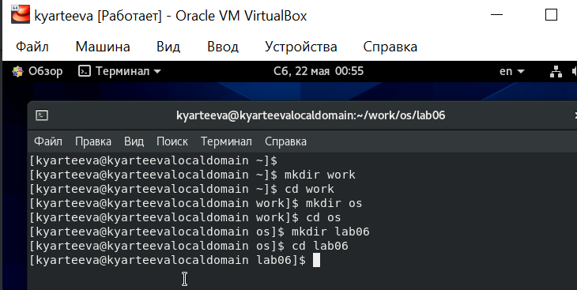

2. Вызвала vi и создала файл hello.sh.


3. Нажала клавишу i и ввела следующий текст:

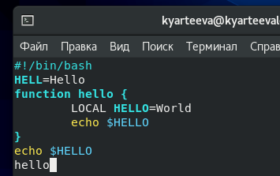

4. Нажала клавишу ```Esc``` для перехода в командный режим после завершения ввода текста.
5. Нажала ```:``` для перехода в режим последней строки.
6. Нажала ```w```(записать) и ```q```(выйти), а затем нажала клавишу ```Enter``` для сохранения текста и завершения работы.
 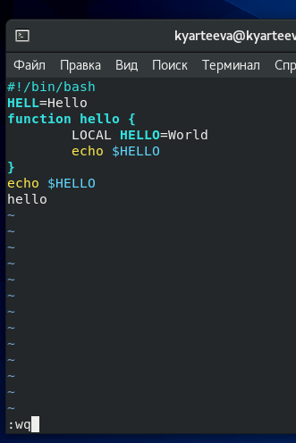

7. Сделала файл исполняемым  

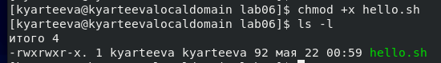

### Задание 2. Редактирование существующего файла
1. Вызвала vi на редактирование файла hello.sh


2. Установила курсор в конец слова HELL второй строки.
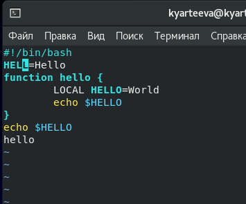

3. Перешла в режим вставки и замените на HELLO. Нажала ```Esc``` для возврата в командный режим.
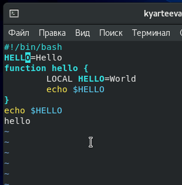

4. Установила курсор на четвертую строку и стерла слово LOCAL.
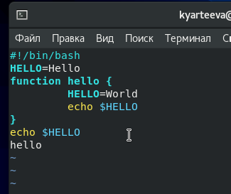

5. Перешла в режим вставки и наберала следующий текст : local, нажала ```Esc``` для возврата в командный режим.
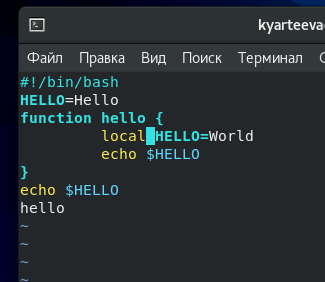

6. Установила курсор на последней строке файла. Вставила после неё строку, содержащую следующий текст:echo $HELLO.
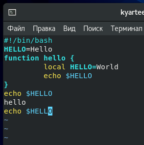

7. Нажала Esc для перехода в командный режим.

8. Удалила последнюю строку.
 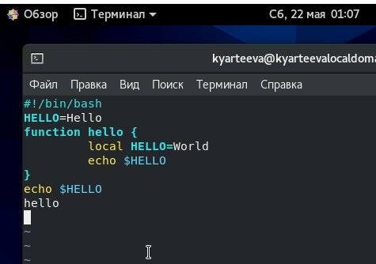

9. Ввела команду отмены изменений ```u``` для отмены последней команды.
 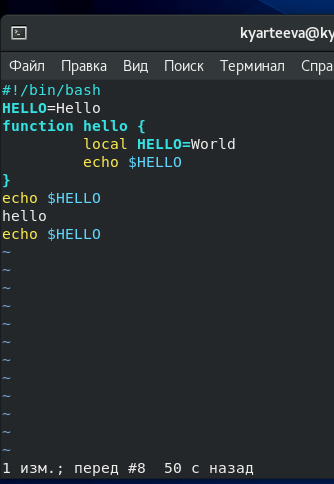

10. Ввела символ ```:``` для перехода в режим последней строки. Запиcала произведённые изменения и выйдите из vi.
 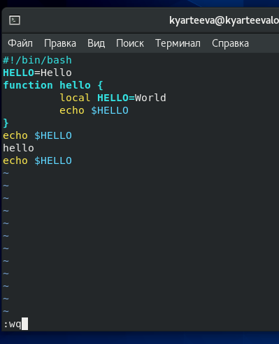
 

## Контрольные вопросы

1. Редактор vi имеет три режима работы:
    – командный режим — предназначен для ввода команд редактирования и навигации по редактируемому файлу;
    – режим вставки — предназначен для ввода содержания редактируемого файла;
    – режим последней (или командной) строки — используется для записи изменений в файл и выхода из редактора.

2. Для выхода из редактора vi необходимо перейти в режим последней строки: находясь в командном режиме нажать ```:```? затем набрать символ ```q``` (или ```q!```), если требуется выйти из редактора без сохранения.

3.  Команды позиционирования:
    – ```0``` (ноль) — переход в начало строки;
    – ```$``` — переход в конец строки;
    – ```G``` — переход в конец файла;
    – ```n G``` — переход на строку с номером n.

4. Слово в vi: gри использовании прописных W и B под разделителями понимаются только пробел, табуляция и возврат каретки. При использовании строчных w и b под разделителями понимаются также любые знаки
пунктуации.

5. – ```G``` — переход в конец файла;
   - ```1 G``` — переход в начало файла;

6. Вставка текста, вставка строки, удаление текста, отмена и повтор произведённых изменений, копирование текста в буфер, вставка текста из буфера, замена текста, поиск текста.
7. Для того, чтобы заполнить строку символом ```$``` : написать $, cкопировать (Y), вставить n раз i+n.
8. ```u``` — отменить последнее изменение;
9. В режиме командной строки доступны копирование и перемещение текста, запись в файл и выход из редактора и настройки.
10. ```$``` — переход в конец строки;
11. ```:```set Показывает значения всех опций, которые отличаются от настройки по умолчанию.
```:```set all Показывает значение всех опций, кроме терминальных.
```:```set termcap Показывает все терминальные опции. Обратите внимание, что в графическом интерфейсе коды клавиш не показываются, поскольку они генерируются на внутреннем уровне и не могут быть изменены. Изменение кодов терминала в графическом интерфейсе не приводит ни к каким полезным изменениям.
```:```set {опция}? Показать значение {опции}.
```:```set {опция} Переключатель: включить опцию.
```:```set no{опция} Переключатель: отключить опцию.
12. При запуске редактора vi вы оказываетесь в командном режиме. Переход в режим ввода из командного режима осуществляется командой ```i```. Выход из режима ввода в командный режим осуществляется клавишей ```Esc```.
13. 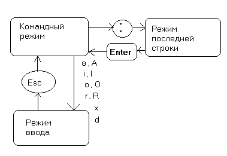
## Вывод
> В ходе лабораторной работы я получила практические навыки работы с редактором vi, установленным по умолчанию практически во всех дистрибутивах.
