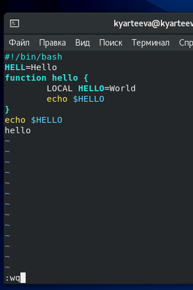

# Презентация по лабораторной работе №9
         Текстовый редактор vi

***Российский Университет Дружбы Народов***

***Факультет Физико-Математических и Естественных Наук***

 ***Дисциплина:*** *Операционные системы*

 ***Работу выполняла:*** *Артеева Кристина Юрьевна*

 *1032202463*

 *НКНбд-01-20*
 ---

В ходе изучения курса "Операционные системы" передо мной встала следующая цель: ознакомиться с операционной системой Linux. Получить практические навыки работы с редактором vi, установленным по умолчанию практически во всех дистрибутивах.

 ---
 Данная задача была разбита на следующие подзадачи:
- создать файл и открыть его с помощью vi
- редактировать файл, используя горячие клавиши

 Изучив теоретический материал, мне удалось достигнуть поставленной цели.

 ---

 * В ходе работы возникали некоторые сложности, но изучив теоретические материалы, мне удалось их разрешить.
Сейчас я могу работать с текстовым редактором vi, редактировать файл с помощью горячий клавиш, а именно совершать следующие операции: вставка текста, вставка строки, удаление текста, отмена и повтор произведённых изменений, копирование текста в буфер, вставка текста из буфера, замена текста, поиск текста.
 ---
Рис.1 Вызов vi и создание файла hello.sh.

Рис.2 Ввод текста

Рис.3 Запись и выход

 

 ---

 # Вывод
 В ходе лабораторной работы я получила практические навыки работы с редактором vi, установленным по умолчанию практически во всех дистрибутивах.
