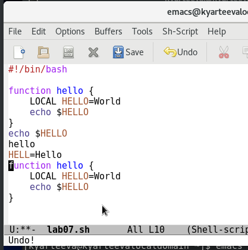
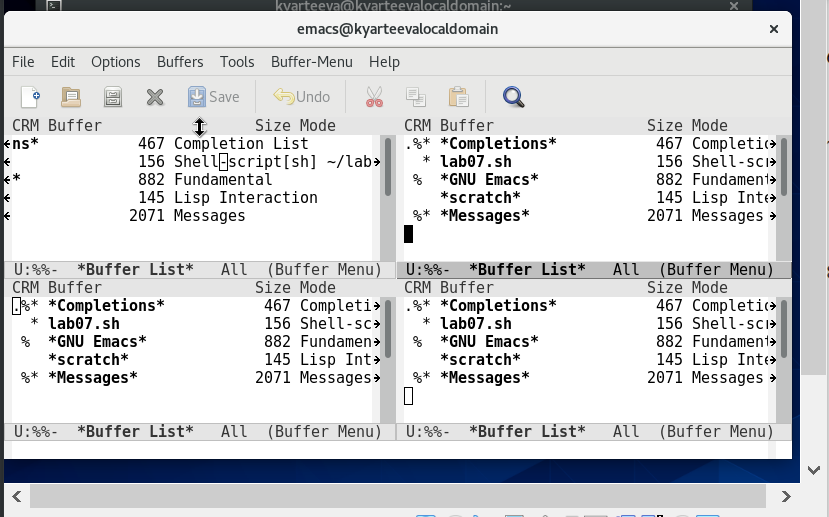

# Отчёт о выполнении лабораторной работы №10 
       Текстовой редактор emacs


***Российский Университет Дружбы Народов***  
***Факультет Физико-Математических и Естественных Наук***  

 ***Дисциплина:*** *Операционные системы*  
 
 ***Работу выполняла:*** *Артеева Кристина*  
 
 *1032201673*  
 
 *НКНбд-01-20*  
 
 
## Цель работы 
    Познакомиться с операционной системой Linux. Получить практические навыки работы с редактором Emacs.

## Задание 
1. Открыть emacs.
2. Создать файл lab07.sh с помощью комбинации ```Ctrl-x``` ```Ctrl-f``` (C-x C-f).
3. Наберите текст:
        #!/bin/bash
        HELL=Hello
        function hello {
            LOCAL HELLO=World
            echo $HELLO
        }
        echo $HELLO
        hello

4. Сохранить файл с помощью комбинации ```Ctrl-x``` ```Ctrl-s``` (C-x C-s).
5. Проделать с текстом стандартные процедуры редактирования, каждое действие
должно осуществляться комбинацией клавиш.
    5.1. Вырезать одной командой целую строку (С-k).
    5.2. Вставить эту строку в конец файла (C-y).
    5.3. Выделить область текста (C-space).
    5.4. Скопировать область в буфер обмена (M-w).
    5.5. Вставить область в конец файла.
    5.6. Вновь выделить эту область и на этот раз вырезать её (C-w).
    5.7. Отмените последнее действие (C-/).

6. Научитесь использовать команды по перемещению курсора.
    6.1. Переместите курсор в начало строки (C-a).
    6.2. Переместите курсор в конец строки (C-e).
    6.3. Переместите курсор в начало буфера (M-<).
    6.4. Переместите курсор в конец буфера (M->).

7. Управление буферами.
    7.1. Вывести список активных буферов на экран (C-x C-b).
    7.2. Переместитесь во вновь открытое окно (C-x) o со списком открытых буферов и переключитесь на другой буфер.
    7.3. Закройте это окно (C-x 0).
    7.4. Теперь вновь переключайтесь между буферами, но уже без вывода их списка
    на экран (C-x b).

8. Управление окнами.
    8.1. Поделите фрейм на 4 части: разделите фрейм на два окна по вертикали
    (C-x 3), а затем каждое из этих окон на две части по горизонтали (C-x 2)
    8.2. В каждом из четырёх созданных окон откройте новый буфер (файл) и введите несколько строк текста.

9. Режим поиска
    9.1. Переключитесь в режим поиска (C-s) и найдите несколько слов, присутствующих в тексте.
    9.2. Переключайтесь между результатами поиска, нажимая C-s.
    9.3. Выйдите из режима поиска, нажав C-g.
    9.4. Перейдите в режим поиска и замены (M-%), введите текст, который следует
    найти и заменить, нажмите Enter , затем введите текст для замены. После того как будут подсвечены результаты поиска, нажмите ! для подтверждения
    замены.
    9.5. Испробуйте другой режим поиска, нажав M-s o. Объясните, чем он отличается от обычного режима?


## Выполнение работы

1. Открыла emacs.


2. Создала файл lab07.sh с помощью комбинации ```Ctrl-x``` ```Ctrl-f```.


3. Набрала текст:


        
4. Сохранила файл с помощью комбинации ```Ctrl-x``` ```Ctrl-s```.

5. Проделала с текстом стандартные процедуры редактирования.

    - Вырезала одной командой целую строку (С-k):

    

    - Вставила эту строку в конец файла (C-y):

    

    - Выделила область текста (C-space):

    

    - Скопировала область в буфер обмена (M-w).
    - Вставила область в конец файла.

    

    - Вновь выделила эту область и на этот раз вырезала её (C-w).

    

    - Отменила последнее действие (C-/).

    

6. Научилась использовать команды по перемещению курсора.
    - Перемещение курсора в начало строки (C-a), в конец строки (C-e), в начало буфера (M-<), в конец буфера (M->):

     

     


7. Управление буферами.
    - Вывела список активных буферов на экран (C-x C-b).

    
    - Переместилась во вновь открытое окно (C-x) o со списком открытых буферов и переключитесь на другой буфер.
    

    - Закрыла это окно (C-x 0).
    - Теперь вновь переключалась между буферами, но уже без вывода их списка
    на экран (C-x b).

8. Управление окнами.
    - Поделила фрейм на 4 части: разделите фрейм на два окна по вертикали
    (C-x 3), а затем каждое из этих окон на две части по горизонтали (C-x 2)

     
    
    - В каждом из четырёх созданных окон открыла новый буфер (файл) и ввела несколько строк текста.

     

9. Режим поиска
    - Переключилась в режим поиска (C-s) и нашла несколько слов, присутствующих в тексте.

    ![поиск]](screens/10.15.png)
    
    - Переключилась между результатами поиска, нажимая C-s.

    

    - Вышла из режима поиска, нажав C-g.

    - Испробовала другой режим поиска, нажав M-s o. От обычного режима отличается тем, что найденное слово высвечивает в другом окне с указанием строки, в которой оно находится.

    


## Контрольные вопросы

1. Emacs представляет собой мощный экранный редактор текста, написанный на
языке высокого уровня Elisp.

2. Неинтуитивный интерфейс

3. Буфер — объект, представляющий какой-либо текст.
   Окно — прямоугольная область фрейма, отображающая один из буферов.

4. Да

5. Emacs использует буферы с именами, начинающимися с пробела, для внутренних целей. Отчасти он обращается с буферами с такими именами особенным образом — например, по умолчанию в них не записывается информация для отмены изменений.

6. ```CTRL+c``` и  ```CTRL+c  CTRL+Shift```
7. Деление окна на две части по горизонтали (C-x 2).

8. Настройки emacs хранятся в файле . emacs, который хранится в домашней директории пользователя. Кроме этого файла есть ещё папка . emacs.

9.  Удаляет элемент в режиме редактора и переходит на предыдущий символ иначе, переназначить нельзя

10. С редактором vi, более понятный механизм редактирования.


## Вывод
> В ходе лабораторной работы я получила практические навыки работы с редактором Emacs.
