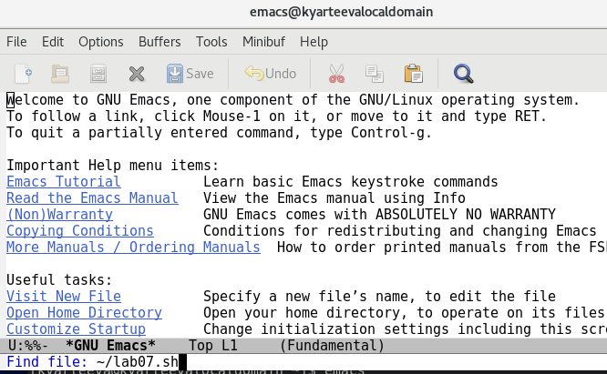
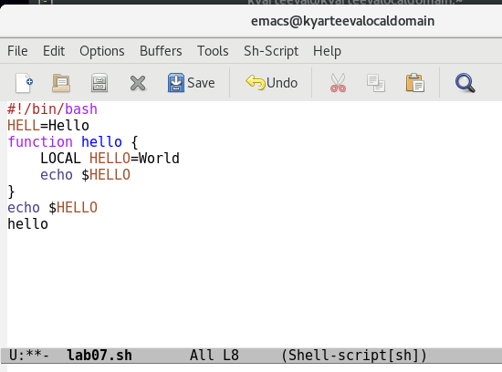
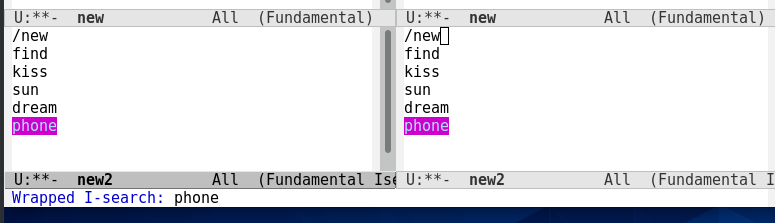

# Презентация по лабораторной работе №10
         Текстовой редактор emacs

***Российский Университет Дружбы Народов***

***Факультет Физико-Математических и Естественных Наук***

 ***Дисциплина:*** *Операционные системы*

 ***Работу выполняла:*** *Артеева Кристина Юрьевна*

 *1032202463*

 *НКНбд-01-20*
 ---

В ходе изучения курса "Операционные системы" передо мной встала следующая цель: получить практические навыки работы с редактором Emacs.

 ---
 Данная задача была разбита на следующие подзадачи:
- создать файл и открыть его с помощью emacs
- редактировать файл, используя горячие клавиши
- научиться управлять активными буферами
- поиск слов в файле.

 Изучив теоретический материал, мне удалось достигнуть поставленной цели.

 ---

 * В ходе работы возникали некоторые сложности, но изучив теоретические материалы, мне удалось их разрешить.
Сейчас я могу работать с редактором emacs, редактировать файл с помощью горячий клавиш, а именно совершать следующие операции: вставка текста, вставка строки, удаление текста, отмена и повтор произведённых изменений, копирование текста в буфер, вставка текста из буфера, замена текста. Могу создать несколько окон и работать с несколькими файлами одновременно, осуществлять поиск в файле.
 ---
Рис.1 Вызов emasc и создание файла.

Рис.2 Ввод текста

Рис.3 Поиск в нескольких окнах

 

 ---

 # Вывод
 > В ходе лабораторной работы я получила практические навыки работы с редактором Emacs.
