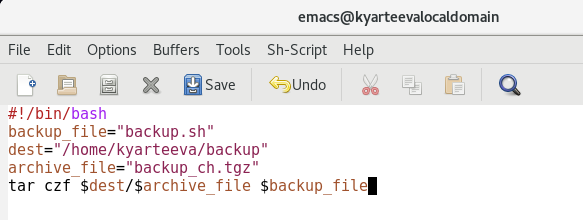
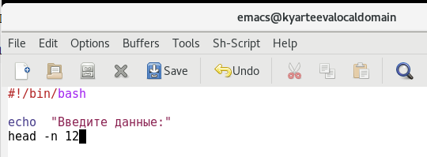
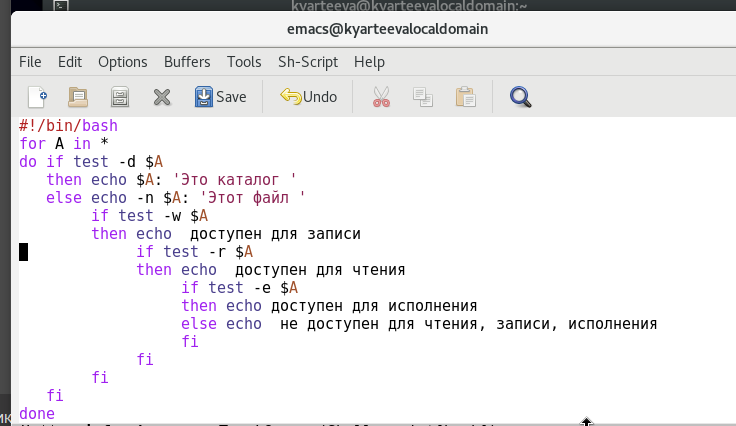
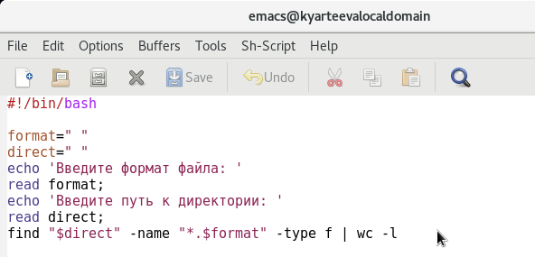

# Презентация по лабораторной работе №11
         Программирование в командном процессоре ОС UNIX. Командные файлы

***Российский Университет Дружбы Народов***

***Факультет Физико-Математических и Естественных Наук***

 ***Дисциплина:*** *Операционные системы*

 ***Работу выполняла:*** *Артеева Кристина Юрьевна*

 *1032202463*

 *НКНбд-01-20*
 ---

В ходе изучения курса "Операционные системы" передо мной встала следующая цель:  изучить основы программирования в оболочке ОС UNIX/Linux, научиться писать небольшие командные файлы.

 ---
 Данная задача была разбита на следующие подзадачи:
- изучить основы программирования в оболочке ОС UNIX/Linux
- написать небольшие командные файлы

 Изучив теоретический материал, мне удалось достигнуть поставленной цели.

 ---

 * В ходе работы возникали некоторые сложности, но изучив теоретические материалы, мне удалось их разрешить.
Сейчас я могу писать и запускать небольшие командные файлы, а именно программы для архивации файла, для обработки аргументов из командной строки, для выдачи информации о каталоге и возможностях доступа к файлам, подсчет файлов по нужному расширению.
 ---
Рис.1 Скрипт архивации

Рис.2 Обработка аргументов

Рис.3 Скрипт: информация о файле

Рис.4 Скрипт: поиск по расширению

 ---

 # Вывод
 > В ходе лабораторной работы я получила изучила основы программирования в оболочке ОС UNIX/Linux, научилась писать небольшие командные файлы.
