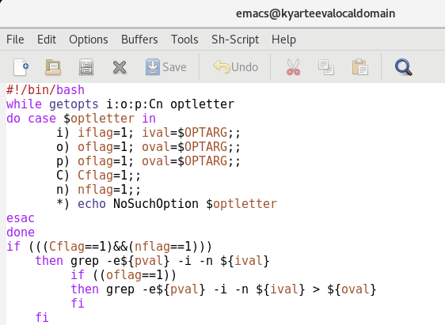

# Презентация по лабораторной работе №12
        Программирование в командном процессоре ОС UNIX. Ветвления и циклы

***Российский Университет Дружбы Народов***

***Факультет Физико-Математических и Естественных Наук***

 ***Дисциплина:*** *Операционные системы*

 ***Работу выполняла:*** *Артеева Кристина Юрьевна*

 *1032202463*

 *НКНбд-01-20*
 ---

В ходе изучения курса "Операционные системы" передо мной встала следующая цель: изучить основы программирования в оболочке ОС UNIX, научится писать более сложные командные файлы с использованием логических управляющих конструкций и циклов.

 ---
 Данная задача была разбита на следующие подзадачи:
- изучить основы программирования в оболочке ОС UNIX/Linux
- написать более сложные командные файлы с использованием логических управляющих конструкций и циклов

 Изучив теоретический материал, мне удалось достигнуть поставленной цели.

 ---

 * В ходе работы возникали некоторые сложности, но изучив теоретические материалы, мне удалось их разрешить.
Сейчас я могу писать и запускать небольшие командные файлы, а именно программы для архивации файлов, для анализа командной строки с ключами, для создание и удаления определенного количества  файлов, вызов в командном файле программы на языке Си.
 ---
   Рис.1 Анализ командной строки с ключами

   

   Рис.2 Анализ командной строки с ключами

   

   Рис.3 Программа на Си

   

   Рис.4 Командный файл

   

   Рис.5 Создание файлов

   

   
   Рис.6 Архивация

   

 ---

 # Вывод
 > В ходе лабораторной работы я получила изучила основы программирования в оболочке ОС UNIX/Linux, научилась писать более сложные командные файлы с использованием логических управляющих конструкций и циклов.

