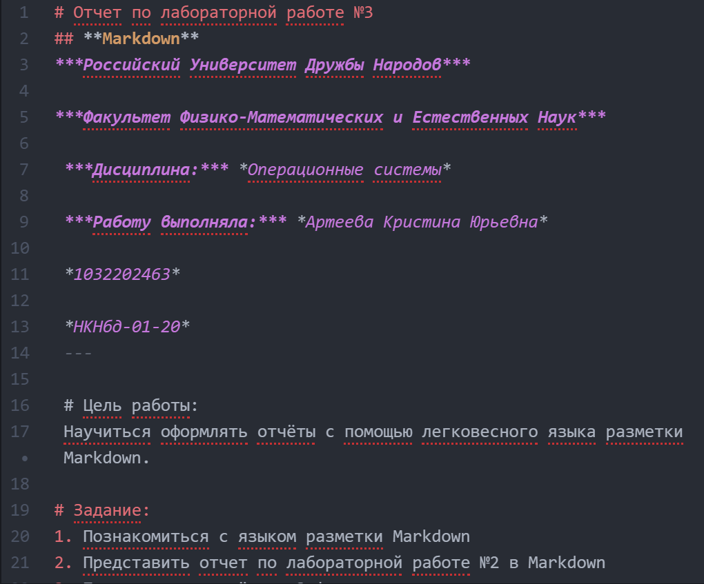

# Презентация по лабораторной работе №3
**Markdown**
***Российский Университет Дружбы Народов***

***Факультет Физико-Математических и Естественных Наук***

 ***Дисциплина:*** *Операционные системы*

 ***Работу выполняла:*** *Артеева Кристина Юрьевна*

 *1032202463*

 *НКНбд-01-20*
 ---

В ходе изучения курса "Операционные системы" передо мной встала следующая цель: научиться оформлять отчеты с помощью языка Markdown

 ---
 Данная задача была разбита на следующие подзадачи:
- познакомиться с элементами языка Markdown.
- научиться конвертировать md в другие форматы.

 Изучив теоретический материал, мне удалось достигнуть поставленной цели.

 ---

В ходе работы я узнала, как можно в Markdown сделать текст **полужирным** или *курсивным*, научилась писать формулы, вставлять картинки и ссылки, создавать неупорядоченные и упорядоченные списки, вложенные.

 ---

 

 ---

 # Вывод
 Данная лабораторная работа помогла мне познакомиться с языком Markdown и предоставлять отчеты в разных форматах
