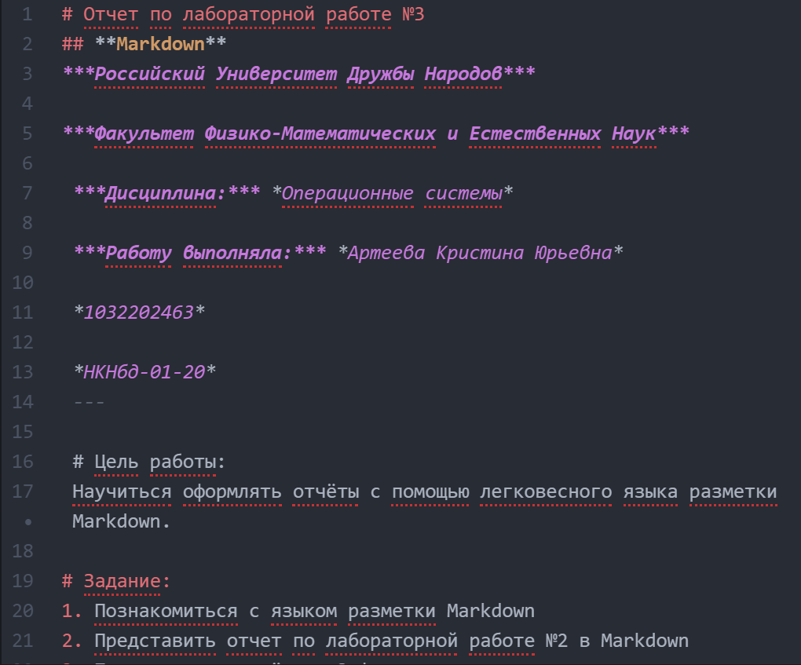

# Отчет по лабораторной работе №3
## **Markdown**
***Российский Университет Дружбы Народов***

***Факультет Физико-Математических и Естественных Наук***

 ***Дисциплина:*** *Операционные системы*

 ***Работу выполняла:*** *Артеева Кристина Юрьевна*

 *1032202463*

 *НКНбд-01-20*
 ---

 # Цель работы:
 Научиться оформлять отчёты с помощью легковесного языка разметки Markdown.

# Задание:
1. Познакомиться с языком разметки Markdown
2. Представить отчет по лабораторной работе №2 в Markdown
3. Предоставить отчёты в 3 форматах:
  - pdf
  - docx
  - md

# Выполнение лабораторной работы:
1. Для создания заголовка использовала знак #
#Заголовок
2. **Полужирное начертание**
3. *Курсивное начертание*
4. ***Полужирное и курсичвное начертание***
5. > Цитата
6. Неупорядоченный список:
  - list
  - list
7. Вложенный список:
  - list 1
    - listik 1
  - list 2
8. ```Огражденный блок```
9. Формула:
    $\sin^2 (x) + \cos^2 (x) = 1$
10. Картинка:


# Вывод:
Я познакомилась с языком разметки Markdown и научилась конвертировать файл md в другие форматы.
