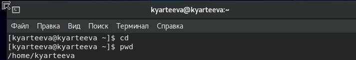
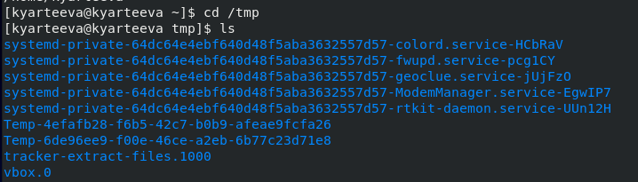
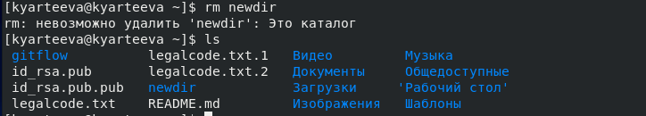

# Презентация по лабораторной работе №5
 Основы интерфейса взаимодействия пользователя с системой Unix на уровне командной строки

***Российский Университет Дружбы Народов***

***Факультет Физико-Математических и Естественных Наук***

 ***Дисциплина:*** *Операционные системы*

 ***Работу выполняла:*** *Артеева Кристина Юрьевна*

 *1032202463*

 *НКНбд-01-20*
 ---

В ходе изучения курса "Операционные системы" передо мной встала следующая цель: приобрести практические навыки взаимодействия пользователя с системой
посредством командной строки.

 ---
 Данная задача была разбита на следующие подзадачи:
- Свободно ориентироваться в файловой системе
- Беспрепятственно создавать и удалять файлы и каталоги
- Изучить опции известных функций

 Изучив теоретический материал, мне удалось достигнуть поставленной цели.

 ---

 * В ходе работы возникали некоторые сложности, но изучив теоретические материалы, мне удалось их разрешить.
Сейчас я могу совершать основные операции через консоль, а именно 
перемещение по файловой системе, определение абсолютного пути к текущему каталогу, создавать и просматривать содержимое каталога и др.
 ---
Рис.1 Перемещение и просмотр абсолютного пути

 

Рис.2 Просмотр содержимого каталога

 

Рис.3 Создание каталога

 

Рис.4 Удаление каталога

 
 ---

 # Вывод
 Данная лабораторная работа помогла мне научиться взаимойдействовать с системой посредством командной строки.
